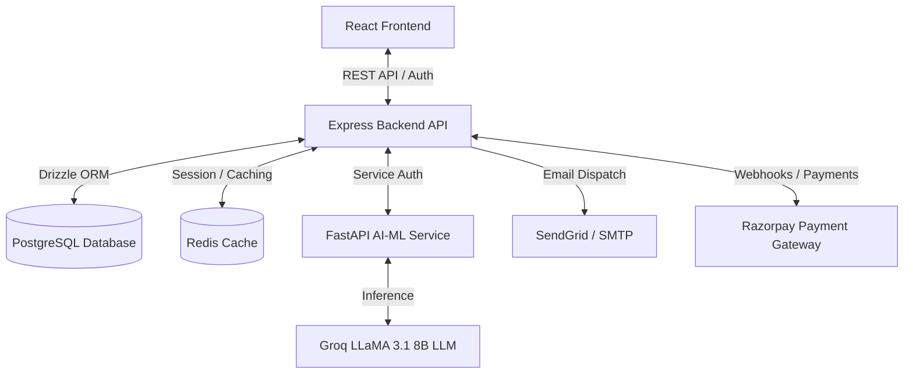

# Jaktra

An enterprise-grade accounts receivable automation platform that replaces manual collection workflows with intelligent, multi-channel agents. It orchestrates communication cycles from initial reminders to payment reconciliation.

## System Architecture

The platform is structured as a decoupled, multi-service system comprising three core components:

1. **Frontend Dashboard**: A responsive web portal built with React, TypeScript, and Vite.
2. **Backend Engine**: A central API service built with Express, TypeScript, and Drizzle ORM, backed by a PostgreSQL database.
3. **AI-ML Service**: A high-performance Python FastAPI service dedicated to agent execution, risk analysis, and generative AI features.




---

## Core Modules & Functionality

### 1. Multi-Tenant Backend (backend/)
- **Authentication**: JWT-based session security with bcryptjs password hashing and route protection.
- **Tenant Isolation**: Complete database and route-level namespace isolation for multiple organizations.
- **Invoice & Collections Management**: Automated workflows for tracking payment statuses (Pending, Paid, Overdue, Written Off).
- **Communication Engine**: Scheduled follow-ups using a timezone-aware scheduling system with support for SendGrid or custom SMTP credentials.
- **Payment Gateway Integration**: Custom adapters for Razorpay supporting dynamic payment link generation and automated webhooks validation.
- **Dead Letter Queue (DLQ)**: Isolates failed communications and halts retry loops on high-consecutive failures.
- **Idempotency Guard**: Guarantees that only one collection message is dispatched within a 20-hour window per invoice.

### 2. React SPA Frontend (frontend/)
- **Dashboard**: High-level collection summaries, aging pyramids, and analytics charts using Recharts.
- **Invoice Portal**: Invoices view, importing from CSV, tracking communication logs, and sending manual overrides.
- **Agent Controls**: Visibility into active agent execution runs, success metrics, and DLQ reviews.
- **Team Management**: User role configurations (Admin, Manager, Viewer) and invitations handling.
- **System Settings**: Configurable email templates, tenant parameters, and payment integration setups.

### 3. FastAPI AI-ML Engine (ai-ml/)
- **FastAPI Endpoint Routing**: Dedicated endpoints for `/health`, `/generation`, `/risk`, and `/agents`.
- **Structured LLM Generation**: Prompts tailored to a 5-Stage Tone Escalation Matrix (Warm, Firm, Serious, Stern, Legal Stop).
- **Output Validation**: Structure validators ensure subjects and payment links are formatted correctly.
- **Security & Redaction**: Prompt injection filtering and automated PII masking on outbound payloads.
- **Risk Assessment**: Score-based models evaluating likelihood of default to dynamically adjust communication parameters.

---

## The 5-Stage Tone Escalation Matrix

The collection logic follows an incremental escalation matrix designed to maximize cash flow while retaining commercial relationships:

1. **Stage 1 (Warm Reminder)**: Sent 1-7 days past due. Informative and helpful tone.
2. **Stage 2 (Firm Follow-up)**: Sent 8-14 days past due. Direct request for payment confirmation.
3. **Stage 3 (Serious Notice)**: Sent 15-21 days past due. Mentions potential access constraints or terms breach.
4. **Stage 4 (Stern Warning)**: Sent 22-30 days past due. Explicit payment deadlines.
5. **Stage 5 (Legal Stop)**: Halts the automated pipeline. Requires manual human override and legal review.

---

## Directory Layout

```
.
├── backend/                  # Express + TypeScript + Drizzle ORM API
│   ├── src/
│   │   ├── db/               # PostgreSQL schema & database client
│   │   ├── middleware/       # Auth, rate-limiter, error handling
│   │   └── modules/          # Domain services (auth, agent, invoices)
│   └── migrations/           # Drizzle SQL migration output files
├── frontend/                 # React + TypeScript SPA Dashboard
│   ├── src/
│   │   ├── pages/            # View pages (Dashboard, Invoices, DLQ)
│   │   └── components/       # Shared UI components
├── ai-ml/                    # Python FastAPI service & agent scripts
│   ├── api/                  # FastAPI router endpoints & middlewares
│   └── src/                  # Agent core, safety filters, prompt registry
└── implementation_plan/      # System vision documents & phase plans
```

---

## Suresh Jakhar